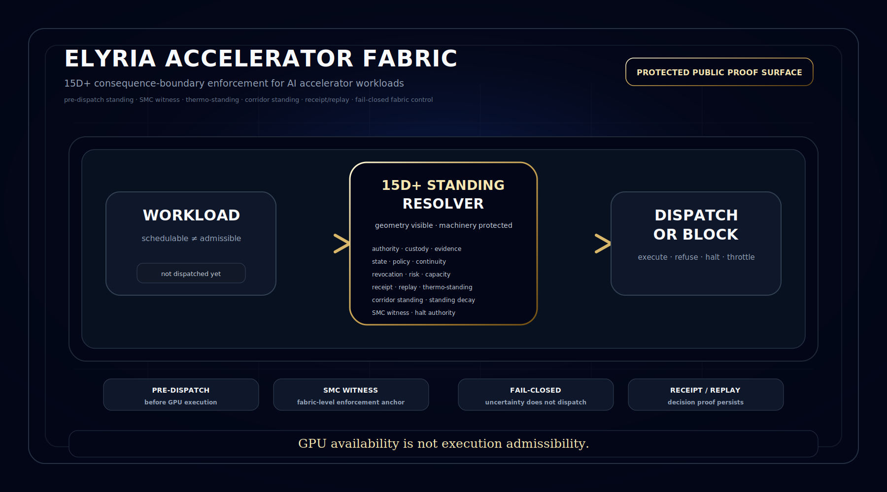

# Elyria Accelerator Fabric


Built by **Elyria Systems — VA**.

Copyright (c) 2026 **Samantha Revita** and **Terry Snyder**. All rights reserved.

This repository is a **protected public proof surface**. It is **not open source**.



## Core claim

```text
Nothing reaches accelerator execution unless standing resolves first.

GPU availability is not execution admissibility.
```

## What this is

Elyria Accelerator Fabric is a **pre-dispatch admissibility boundary** for AI accelerator workloads.

It determines whether a workload has standing to reach GPU execution under current authority, custody, policy, capacity, thermal, corridor, and replay conditions.

The goal is not to monitor compute after it begins.

The goal is to decide whether consequence-bearing compute may be admitted before it runs.

## What this is not

This is not GPU monitoring, observability, a dashboard, a scheduler replacement, a compliance wrapper, a generic AI safety label, a claim of NVIDIA partnership, a claim of CUDA-level integration, or a claim of fabricated hardware.

## Public 15D+ standing geometry

```text
authority · custody · evidence · state · policy
continuity · revocation · risk · capacity · failure behavior
receipt basis · replay basis · thermo-standing · corridor standing · standing decay
```

Accelerator-specific public extension:

```text
compute-lane standing · memory-pressure standing · tenant-partition standing
fabric-link standing · scheduler-integrity standing · gradient-flow standing
energy-debt standing · thermal-headroom standing · quiesce-capability standing · halt-authority standing
```

Public rule:

```text
Show the geometry.
Do not disclose the machinery.
```

## Architecture

```text
Workload Request
  ↓
Governed Workload Envelope
  ↓
Fabric Canonicalization
  ↓
15D+ Standing Geometry Resolver
  ↓
SMC / Accelerator Safety Fabric
  ↓
Dispatch Decision
  ↓
GPU / Fabric Execution only if admitted
  ↓
Receipt + Replay + Audit Chain
  ↓
Standing Decay Monitor
  ↓
Revoke / Halt / Quarantine / Rebound
```

## Boundary outcomes

```text
EXECUTE
REFUSE
ESCALATE
HALT
THROTTLE
FENCE
QUARANTINE
REVOKE_DISPATCH
REBOUND
```

Only `EXECUTE` permits accelerator dispatch.

## Run the proof

```bash
python accelerator_fabric_validator.py examples/valid_inference_workload.json
python accelerator_fabric_validator.py examples/revoked_authority_workload.json
python accelerator_fabric_validator.py examples/thermal_halt_workload.json
python accelerator_fabric_validator.py examples/replay_missing_workload.json
python accelerator_fabric_validator.py examples/standing_decay_workload.json
python test_accelerator_fabric_validator.py
```

## Expected public proof corridor

| Fixture | Expected outcome | Fabric action |
|---|---|---|
| valid workload | EXECUTE | ALLOW_DISPATCH |
| revoked authority | REFUSE | BLOCK_DISPATCH |
| thermal critical | HALT | STOP_EXECUTION |
| capacity degraded | THROTTLE | NARROW_OR_REVIEW |
| replay missing | HALT | BLOCK_CERTIFICATION |
| standing decay | REVOKE_DISPATCH | REVOKE_OR_REBOUND |

## Final build statement

```text
Elyria Accelerator Fabric is a 15D+ accelerator consequence-boundary fabric where hardware monitoring, fixed-point safety debt, thermo-standing, corridor standing, receipt/replay, and fail-closed dispatch control converge.

The SMC does not merely observe GPU safety.

It becomes the non-bypassable enforcement witness for whether accelerator-bound consequence was admissible before it ran.
```
